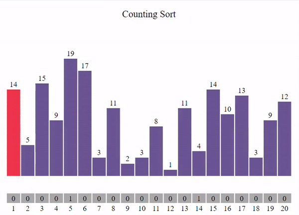
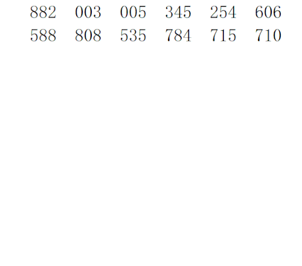

# data-structures-algorithms

1. **Arrays**

- Static Arrays
- Dynamic Arrays
- Multidimensional Arrays

- Sorting Algorithms

  1. **Bubble Sort** – Repeatedly swaps adjacent elements if they are in the wrong order.

     

  2. **Selection Sort** – Selects the minimum element and places it at the beginning.

     

  3. **Insertion Sort** – Builds a sorted array one element at a time (good for small datasets).

     

  4. **Gnome Sort** – Swaps like bubble sort but steps back when out of order.

     

  5. **Cocktail Sort** – A bi-directional version of bubble sort.

     

  6. **Comb Sort** – Bubble sort with gap shrinkage to eliminate "turtles"(small values at the end).

     

  7. **Shell Sort** – Generalized insertion sort using decreasing gaps.

     

  8. **Merge Sort** – Recursively divides and merges sorted halves (stable, O(n log n)).

     

  9. **Quick Sort** – Divide-and-conquer using a pivot for partitioning.

     - Lomuto partition scheme (classic)
     - Hoare partition scheme (optimized)
     - Dutch national flag (Three-Way partitioning for duplicates)

     

  10. **Heap Sort** – Converts array into a heap, then extracts elements in order.

      

  11. **Counting Sort** – Counts occurrences (great for small integer ranges).

      

  12. **Radix Sort** – Sorts by individual digits using stable sort per digit.

      

  13. **Bucket Sort** – Distributes elements into buckets, sorts each.

      

2. **Linked Lists**

- Singly Linked List
- Doubly Linked List
- Circular Linked List

3. **Stacks**

- Array-based Stack
- Linked List-based Stack

4. **Queues**

- Array-based Queue
- Linked List-based Queue

5. **Hash Tables**
6. **Trees**
7. **Graphs**

NOTE:
All the GIFs are sourced from GeeksForGeeks and Wikipedia and are used for educational purposes only.
