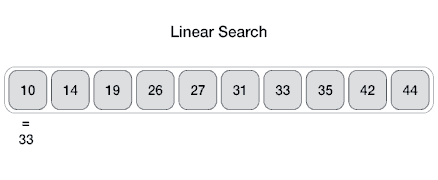
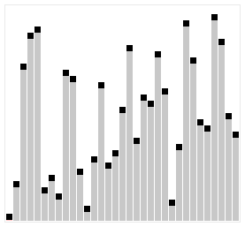
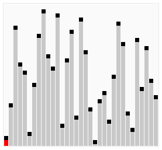

# Data Structures and Algorithms (DSA) 🏛️

## Arrays

### Array Types:

- **Static Arrays**: Fixed size, allocated at compile time.
- **Dynamic Arrays**: Resizable, allocated at runtime (e.g., slices in Go).
- **Multidimensional Arrays**: Arrays of arrays, useful for matrices.

## Searching Algorithms

1. **Linear Search** – Checks each element sequentially.

   

2. **Binary Search** – Efficient search on sorted arrays, divides the array in half each time. Works only on sorted arrays.

   

### Sorting Algorithms

1. **Bubble Sort** – Repeatedly swaps adjacent elements if they are in the wrong order.

   

2. **Selection Sort** – Selects the minimum element and places it at the beginning.

   

3. **Insertion Sort** – Builds a sorted array one element at a time (good for small datasets).

   

4. **Gnome Sort** – Swaps like bubble sort but steps back when out of order.

   

5. **Cocktail Sort** – A bi-directional version of bubble sort.

   

6. **Comb Sort** – Bubble sort with gap shrinkage to eliminate "turtles"(small values at the end).

   

7. **Shell Sort** – Generalized insertion sort using decreasing gaps.

   

8. **Merge Sort** – Recursively divides and merges sorted halves (stable, O(n log n)).

   

9. **Quick Sort** – Divide-and-conquer using a pivot for partitioning.

   - Lomuto partition scheme (classic)
   - Hoare partition scheme (optimized)
   - Dutch national flag (Three-Way partitioning for duplicates)

   

10. **Heap Sort** – Converts array into a heap, then extracts elements in order.

    

11. **Counting Sort** – Counts occurrences (great for small integer ranges).

    

12. **Radix Sort** – Sorts by individual digits using stable sort per digit.

    

13. **Bucket Sort** – Distributes elements into buckets, sorts each.

    

## Linked Lists

### Linked List Types:

- **Singly Linked List**: Each node points to the next node.
- **Doubly Linked List**: Each node points to both the next and previous nodes
- **Circular Linked List**: Last node points back to the first node, forming a circle.

## Stacks

- Array-based Stack
- Linked List-based Stack

## Queues

- Array-based Queue
- Linked List-based Queue

## Hash Tables

## Trees

## Graphs

#### NOTE❗

All visuals are sourced from Wikipedia, GeeksForGeeks and FreeCodeCamp and are used for educational purposes only.
